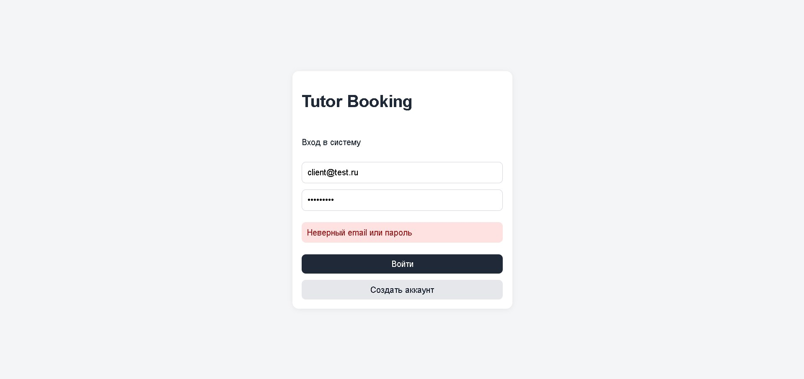
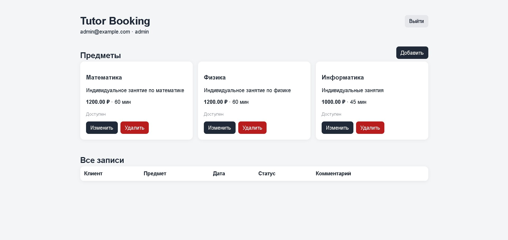
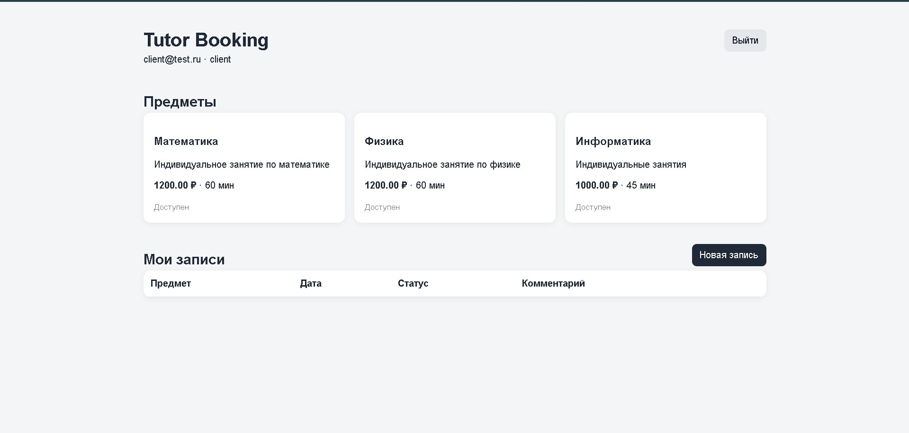

# Tutor Booking

Tutor Booking — учебное full-stack веб-приложение для записи клиентов на индивидуальные занятия.

В системе предусмотрены две роли:

- `client` — обычный пользователь;
- `admin` — администратор.

Проект включает пользовательский интерфейс, серверную часть, базу данных, авторизацию и две бизнес-сущности с полным набором CRUD-операций.

## Возможности

### Client

Клиент может:

- зарегистрироваться;
- авторизоваться;
- просматривать доступные предметы;
- создавать запись на занятие;
- просматривать свои записи;
- изменять свои записи;
- удалять свои записи.

### Admin

Администратор может:

- авторизоваться;
- просматривать все предметы;
- создавать предметы;
- изменять предметы;
- удалять предметы;
- просматривать записи всех клиентов;
- изменять записи;
- удалять записи.

## Скриншоты

### Авторизация



### Панель администратора



### Кабинет клиента



## Используемые технологии

### Frontend

- React
- Vite
- Nginx

### Backend

- Python
- FastAPI
- SQLAlchemy
- JWT

### Database

- PostgreSQL

### Контейнеризация

- Docker
- Docker Compose

## Архитектура

Приложение состоит из трёх основных компонентов:

```text
Пользователь
     │
     ▼
Frontend
React + Nginx
     │
     ▼
Backend
FastAPI
     │
     ▼
Database
PostgreSQL
```

Каждый компонент запускается в отдельном Docker-контейнере.

В `docker-compose.yml` определены:

- `frontend`;
- `backend`;
- `db`.

## Бизнес-сущности

В проекте реализованы две основные бизнес-сущности.

### Subject

Предмет или услуга репетитора.

Поддерживаются операции:

- CREATE;
- READ;
- UPDATE;
- DELETE.

Создание, изменение и удаление предметов доступно администратору.

### Booking

Запись клиента на занятие.

Поддерживаются операции:

- CREATE;
- READ;
- UPDATE;
- DELETE.

Клиент работает со своими записями, а администратор может работать со всеми записями.

## Авторизация

В проекте используется JWT-авторизация.

Поддерживаются две роли:

```text
client
admin
```

Права доступа проверяются на стороне backend.

## Запуск проекта

Для запуска необходим Docker Desktop.

В корневой папке проекта выполнить:

```bash
docker compose up --build
```

После запуска приложение доступно по адресам:

### Web-интерфейс

```text
http://localhost:3000
```

### Swagger API

```text
http://localhost:8000/docs
```

## Тестовый администратор

```text
Email: admin@example.com
Password: admin12345
```

Обычного пользователя можно зарегистрировать через интерфейс приложения.

## Остановка проекта

Для остановки:

```bash
docker compose down
```

## Структура проекта

```text
tutor-booking/
├── backend/
│   ├── app/
│   │   ├── routers/
│   │   │   ├── auth_router.py
│   │   │   ├── bookings.py
│   │   │   └── subjects.py
│   │   ├── auth.py
│   │   ├── database.py
│   │   ├── main.py
│   │   ├── models.py
│   │   └── schemas.py
│   ├── Dockerfile
│   └── requirements.txt
│
├── frontend/
│   ├── src/
│   │   ├── main.jsx
│   │   └── styles.css
│   ├── Dockerfile
│   ├── nginx.conf
│   └── package.json
│
├── docs/
│   ├── images/
│   ├── project-description.md
│   └── use-cases.md
│
├── docker-compose.yml
├── .gitignore
└── README.md
```

## API

### Subjects

```text
GET    /subjects
GET    /subjects/{id}
POST   /subjects
PUT    /subjects/{id}
DELETE /subjects/{id}
```

### Bookings

```text
GET    /bookings
GET    /bookings/{id}
POST   /bookings
PUT    /bookings/{id}
DELETE /bookings/{id}
```

## Use Cases и MVP

Для проекта сформировано:

```text
60 Use Cases
```

Из них:

```text
20 MVP
```

Полный список находится в:

[`docs/use-cases.md`](docs/use-cases.md)

Подробное описание проекта находится в:

[`docs/project-description.md`](docs/project-description.md)
