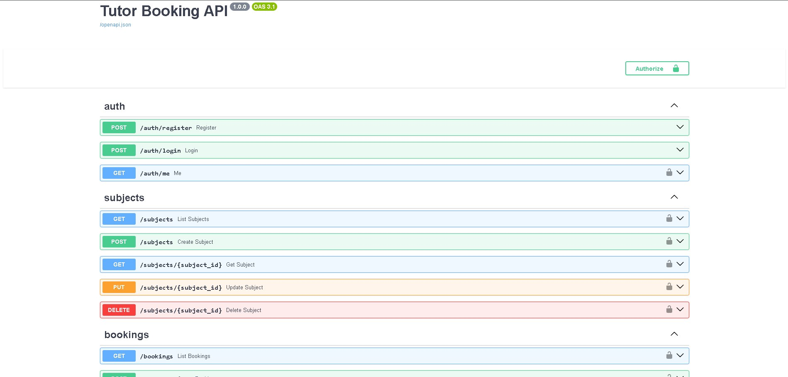
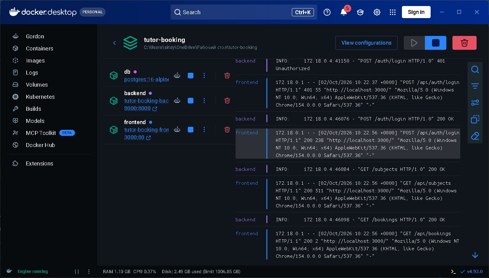

# Tutor Booking

**Tutor Booking** — учебное full-stack веб-приложение для записи клиентов на занятия с репетитором.

В системе реализованы две роли:

- `Client` — обычный пользователь;
- `Admin` — администратор.

Проект включает frontend, backend, PostgreSQL, авторизацию, Docker-контейнеры и две CRUD-сущности.

---

## Возможности

### Client

- регистрация и вход;
- просмотр предметов;
- создание записи на занятие;
- просмотр, изменение и удаление своих записей.

### Admin

- вход;
- создание, изменение и удаление предметов;
- просмотр и управление всеми записями клиентов.

---

## Скриншоты

### Авторизация


### Панель администратора


### Кабинет клиента


### Swagger API



### Docker-контейнеры



---

## Технологии

### Frontend

- React
- Vite
- Nginx

### Backend

- Python
- FastAPI
- SQLAlchemy
- JWT

### Database

- PostgreSQL

### DevOps

- Docker
- Docker Compose
- Git
- GitHub

---

## Архитектура

```text
Пользователь
     ↓
Frontend
React + Nginx
     ↓
Backend
FastAPI
     ↓
Database
PostgreSQL
```

Все части приложения запускаются в отдельных Docker-контейнерах.

---

## CRUD-сущности

В проекте реализованы две основные бизнес-сущности:

### Subject

Предмет репетитора.

Поддерживаются операции:

```text
CREATE
READ
UPDATE
DELETE
```

### Booking

Запись клиента на занятие.

Также поддерживаются:

```text
CREATE
READ
UPDATE
DELETE
```

---

## Авторизация

Используются две роли:

```text
client
admin
```

Права доступа проверяются на стороне backend.

---

## Запуск проекта

Клонировать репозиторий:

```bash
git clone https://github.com/1Cherr8/tutor-booking.git
```

Перейти в папку проекта:

```bash
cd tutor-booking
```

Запустить:

```bash
docker compose up --build
```

После запуска:

### Web-интерфейс

```text
http://localhost:3000
```

### Swagger

```text
http://localhost:8000/docs
```

---

## Тестовый администратор

```text
Email: admin@example.com
Password: admin12345
```

Обычного пользователя можно зарегистрировать через интерфейс.

---

## Структура проекта

```text
tutor-booking/
├── backend/
├── frontend/
├── docs/
│   ├── images/
│   ├── project-description.md
│   └── use-cases.md
├── docker-compose.yml
├── .gitignore
└── README.md
```

---

## Use Cases и MVP

Для проекта подготовлено:

```text
60 Use Cases
20 MVP
```

Полный список находится в:

[`docs/use-cases.md`](docs/use-cases.md)

Подробное описание проекта:

[`docs/project-description.md`](docs/project-description.md)

---

## Итог

В проекте реализованы:

- Git и GitHub;
- 60 Use Cases;
- 20 MVP;
- Server + DB + UI;
- Docker-контейнеризация;
- 2 CRUD-сущности;
- авторизация;
- роли Client и Admin.
